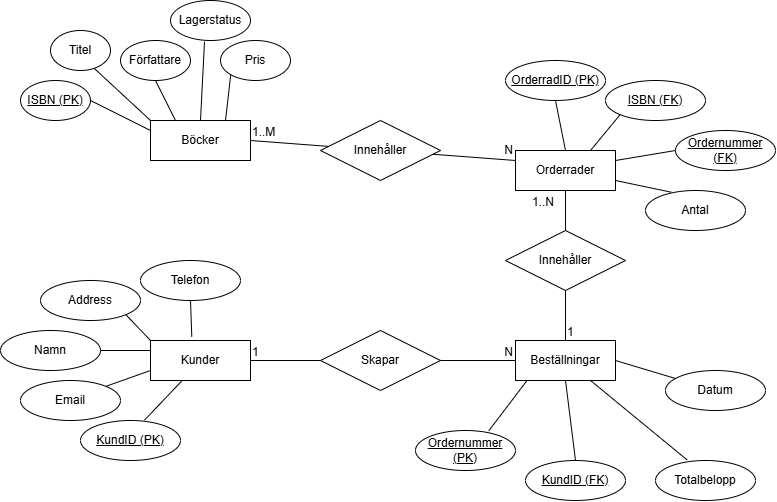

# Databas Inlämning 2
Av: Aaren Bertilsson YH25

Denna SQL databasen är för en liten bokhandel, den består av:
- Böcker
- Kunder
- Beställningar
- Orderrader

## Reflektion och analys av databaslösning
- *Reflektera över varför du designade databasen på det sätt du gjorde*

Det kändes naturligt att skapa den som jag gjorde, då jag har tidigare erfarenhet av att jobba med databaser. Varje entitet representerar en logisk fysisk sak e.x. en beställning & en orderrad, och de olika entiterna är sammankopplade med varandra genom främmande nycklar.

- *Fundera på om något kune gjorts annorlunda och vad du skulle ändra om databasen skulle hantera 100 000 kunder istället för 10*

Hade varit bra om vissa fält, ex. totalbelopp & ordernummer i orderrader hade varit automatiserat. Framförallt för att den ska kunna skalas. Dock är detta nog något jag hade implementerat i koden av applikationen som kommunicerar med databasen, snarare än här

- *Diskutera vilka optimeringar som kan göras i index och struktur för att förbättra prestandan*

Hade kunnat göra Kunder's namn till en index, då det är nåt som just nu används i GROUP BY och WHERE. Sen är detta nåt man måste kolla på kontinuerligt om sättet man använder databasen förändras, e.x. om man börjar använda andra attribut i querys så kanske dessa borde bli indexes. Dock viktigt att samtidigt inte ha allt för många indexes samtidigt i databasen.
